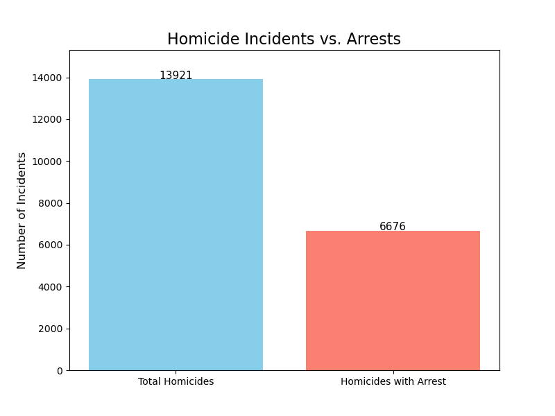

# Chicago Crime Data Analysis (2001–Present)

An exploratory data analysis (EDA) of **7+ million reported crime incidents** in Chicago, spanning over two decades. This project ingests, cleans, and analyzes a public dataset from the City of Chicago to uncover crime patterns, arrest rate disparities, and long-term trends.

## Project Overview

The goal of this analysis is to answer key questions about crime in Chicago using data-driven insights:

- **What are the most common crime types?**
- **How have crime rates changed over time?**
- **How do arrest rates vary across different crime categories?**
- **What proportion of homicides result in an arrest?**

All analysis is performed in a single Jupyter Notebook using **Pandas** for data manipulation and **Matplotlib** for visualization.

## Dataset

- **Source**: [Crimes – 2001 to Present](https://data.cityofchicago.org/Public-Safety/Crimes-2001-to-Present/ijzp-q8t2) (City of Chicago Data Portal)
- **Size**: ~7 million records
- **Fields**: ID, Case Number, Date, Block, IUCR Code, Primary Type, Description, Arrest (Boolean), Domestic, Beat, District, FBI Code, Year, Location, Updated On

The raw CSV is managed via Git LFS due to its size.

## Key Findings

### Top 5 Most Common Crime Types
| Crime Type | Incidents |
|---|---|
| THEFT | 1,782,119 |
| BATTERY | 1,529,944 |
| CRIMINAL DAMAGE | 954,832 |
| NARCOTICS | 762,975 |
| ASSAULT | 561,787 |

### Arrest Rate Disparity
Arrest rates vary dramatically by crime type:

- **NARCOTICS**: ~99.3% arrest rate
- **ROBBERY**: ~9.2% arrest rate

### Homicide Incidents vs. Arrests
Of all homicide incidents, approximately **47.96%** resulted in an arrest.



## Tech Stack

- **Python 3** – Core programming language
- **Pandas** – Data ingestion, cleaning, grouping, and aggregation
- **Matplotlib** – Bar charts and visualizations
- **Jupyter Notebook** – Interactive analysis environment
- **Git LFS** – Version control for large dataset

## Repository Contents

| File | Description |
|---|---|
| `crime.ipynb` | Complete EDA notebook with cleaning, analysis, and visualizations |
| `homicide_arrest_chart.png` | Bar chart comparing total homicides vs. homicides with arrests |
| `README.md` | Project documentation (this file) |
| `.gitattributes` | Git LFS configuration for the raw CSV |

## How to Run

### Prerequisites
- Python 3.8+
- [Jupyter Notebook](https://jupyter.org/install) or JupyterLab

### Setup

```bash
# Clone the repository
git clone https://github.com/trayp20/Chicago-Crime.git
cd Chicago-Crime

# (Optional) Create a virtual environment
python -m venv venv
source venv/bin/activate  # On Windows: venv\Scripts\activate

# Install dependencies
pip install pandas matplotlib jupyter

# Launch the notebook
jupyter notebook crime.ipynb
```

> **Note**: The raw dataset is managed with Git LFS. To download it, run `git lfs pull` after cloning if you don't already have the file.

## Author

**Tray Pendleton** – [GitHub](https://github.com/trayp20)

---

*Data sourced from the City of Chicago Data Portal. This is an educational EDA project, not an official crime analysis.*
